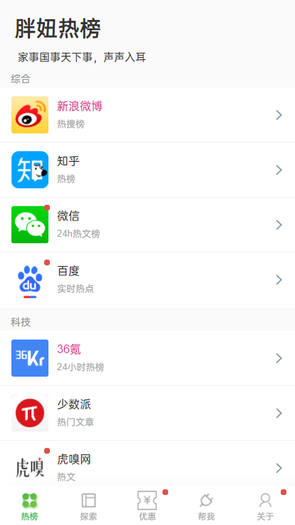
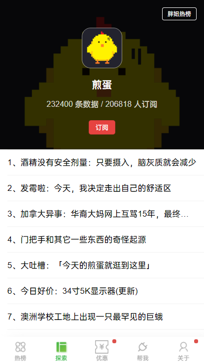

## 前言

该项目是我个人开发的一款简约版的新闻展示类程序。这个项目聚合了互联网多平台的热榜头条，足以做到“家事国事天下事，声声入耳”。

项目是开源的，不收取任何费用。如果这个项目有帮到你，或者你觉得很赞，可以扫描赞赏码支持一下！并且该项目所用到的API，都是自开发的。无使用次数限制，传输速度极快。٩(๑❛ᴗ❛๑)۶

作者我也是花了时间和精力的，开放的API是免费的，我不希望一些“无心人”对接口进行流量攻击~

## 预览

## 交流
备注**新闻**。扫描二维码。

			  

## API
自开发，对互联网新闻类网站资源进行爬取，使用django框架开发API接口。
[开发API](http://guoxiaorui.cn/index.php/archives/73/)

## 演示站点

[胖妞热榜](http://news.guoxiaorui.cn/)

若用电脑端浏览器进入站点，需开启模拟器模式。因为...它是一个使用uni-app开发的h5站点，未做对pc端的全部兼容。